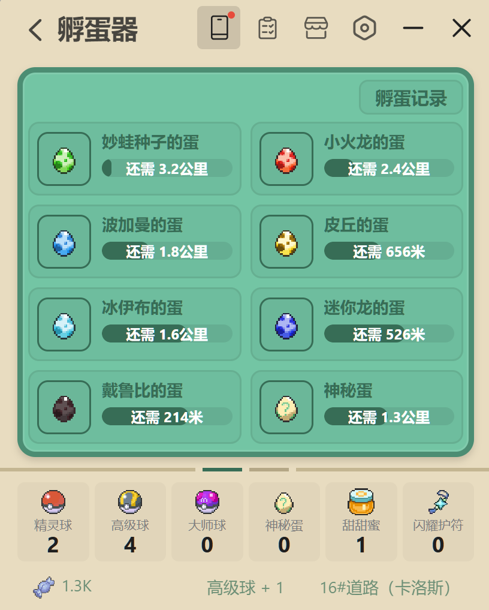
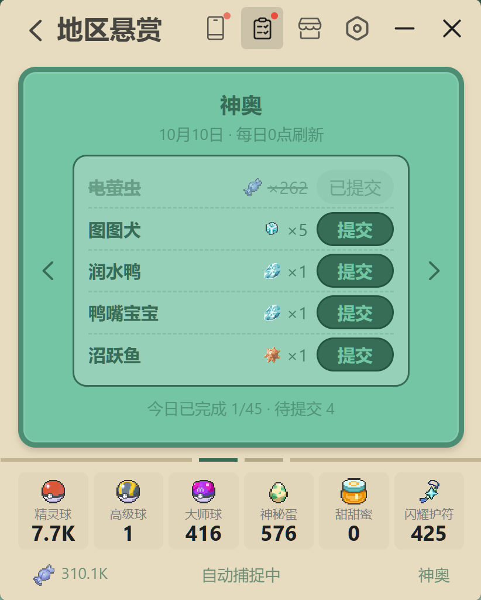

<p align="center">
  
</p>

<h1 align="center">口袋挂机</h1>

<p align="center">
  <em>基于 Tauri v2 的桌面挂机游戏（另有 Android 版）· 纯前端 HTML/CSS/JS + Rust 后端存档</em>
</p>

<p align="center">
  <a href="https://github.com/ZTMYO/PokeIdle/stargazers">
    
  </a>
  <a href="https://github.com/ZTMYO/PokeIdle/blob/main/LICENSE">
    
  </a>
  <a href="https://github.com/ZTMYO/PokeIdle">
    
  </a>
</p>
<p align="center">
  <a href="https://pokeidle.shiliu.space/">https://pokeidle.shiliu.space/</a>
</p>


## 截图预览

<table align="center">
<tr>
<td align="center"></td>
<td align="center"></td>
<td align="center"></td>
<td align="center"></td>
<td align="center"></td>
</tr>
</table>

<table align="center">
<tr>
<td align="center"></td>
<td align="center"></td>
<td align="center"></td>
<td align="center"></td>
<td align="center"></td>
</tr>
</table>

<table align="center">
<tr>
<td align="center"></td>
<td align="center"></td>
<td align="center"></td>
<td align="center"></td>
<td align="center"></td>
</tr>
</table>

<table align="center">
<tr>
<td align="center"></td>
<td align="center"></td>
<td align="center"></td>
<td align="center"></td>
<td align="center"></td>
</tr>
</table>

## 玩法

- **挂机冒险** — 九大地区挂机遇敌、自动拾取与捕捉，目标是完成全图鉴
- **手机系统** — 一整套内置应用：图鉴、宝可梦、教程、道具盒、孵蛋器、饲育屋、树果农场、混合器、交换、派遣、悬赏、卡册、随从、成就、统计、系统日志
- **导航** — 自动规划最短路线，支持漫游循环
- **大量出没** — 随机路段出现大量出没事件，锁定同一只宝可梦连续遭遇
- **时空扭曲** — 从其它地区召来宝可梦，含 RGB 分离 / 污染等特效变体
- **NPC 对战** — 四档训练家挑战，支持全自动战斗
- **游戏厅** — 21 点、口袋麻将与抽卡机，卡册应用查看收集
- **卡牌收集** — TCG 卡牌收集，重复卡可退还游戏币
- **随从** — 宝可梦随行，按属性提供限时增益
- **训练场** — 挂机练级，宝可梦会偷懒；饱食度与树果投喂
- **配队 / 配招** — 拖拽配队、随机配队、自动配招
- **捕捉** — 三种精灵球，自动或手动捕捉
- **闪光** — 稀有的闪光个体，闪耀护符可提升出现概率
- **道具与商店** — 道具掉落、糖果商店与道具盒
- **进化** — 一套完整的进化系统：进化链、进化道具与进化演出
- **增益** — 甜甜蜜与闪耀护符，缩短遇敌间隔、提升稀有与闪光
- **孵蛋** — 按行走里程孵化的孵蛋器，最多 8 个槽位
- **培育** — 饲育屋配对繁殖，蛋回到族内最低阶
- **交换** — 交换广场：按对价换取宝可梦，计入图鉴
- **宝可梦仓库** — 搜索、筛选、排序、详情与放生
- **钓鱼** — 水域自动钓鱼，收获道具或宝可梦
- **树果农场** — 种植与收获树果，告示牌委托与农场帮手
- **树果混合器** — 制作树果方块，可以吸引宝可梦
- **地区悬赏** — 每日悬赏任务与奖励
- **成就** — 累计成就与糖果奖励
- **图鉴** — 全图鉴收录（含变体），列出每个形态的获取途径
- **自动操作** — 自动捕获 / 逃跑 / 续增益，佛系模式
- **离线挂机** — 离线结算每日内容
- **存档** — 自动保存与多重备份

## 游戏亮点

- **导航系统** — 最短路线实时规划
- **大量出没** — 地图上的事件点，事件宝可梦连续遭遇
- **自动战斗** — NPC 对战全程自动
- **游戏厅** — 21 点、口袋麻将与抽卡机，糖果兑换游戏币
- **欧非评定** — 每次遭遇按运气打分，九档称号
- **进化系统** — 从族内最低阶到最终形态的完整进化链，含强化形态与专属道具
- **遗传与培育** — 子代个体值继承双亲，可锁定继承维度
- **农场帮手** — 分阶段工作的自动化农场帮手
- **树果方块** — 用树果吸引宝可梦
- **音乐体验** — 各世代原声洗牌播放不重复，音量自动对齐
- **对战记录** — 可回看本局对战记录
- **随从增益** — 随从按属性提供限时增益
- **自动挂机** — 自动捕获 / 逃跑 / 续增益
- **托盘图标** — 实时显示游戏状态

## 开发

### 前置依赖

- [Node.js](https://nodejs.org/) 18+
- [Rust](https://www.rust-lang.org/) 1.70+
- [Tauri v2 CLI](https://v2.tauri.app/)

### 启动

```bash
npm install
npm run dev
```

### 构建

```bash
npm run build
```

构建产物输出到 `src-tauri/target/release/bundle/nsis/`，生成 NSIS 安装包。

### Android 版

用 Capacitor 把同一份 `src/` 打包成离线 APK，命令与签名步骤见 [`docs/android-build.md`](docs/android-build.md)：

```bash
npm run android:debug     # debug APK，无需签名
npm run android:build     # release APK，需要先初始化签名
```

### 官网

`web/` 是官网（Vite），含首页、图鉴、教程与更新日志页，构建前会自动同步源码、图鉴数据与宝可梦图标雪碧图：

```bash
cd web
npm run dev               # 本地预览
npm run build             # 产出 web/dist
```

## 主要素材来源

- 宝可梦 GIF 动画：[play.pokemonshowdown.com](https://play.pokemonshowdown.com/)
- 宝可梦游戏原声：[khinsider.com](https://downloads.khinsider.com/game-soundtracks)
- 精灵行走图素材：[TaTaTaZJJ/pokemon-overworld-for-gba](https://github.com/TaTaTaZJJ/pokemon-overworld-for-gba)

## 开源协议

> **⚠️ 反倒卖严正声明**
>
> 本项目为作者独立开发的免费开源项目，**严禁任何形式的商业化与倒卖行为**，包括但不限于：
>
> 1. **直接售卖** — 任何打包分发本项目（或仅替换名称、图标、界面就声称"原创"）并收取费用，均属**侵权行为**，发现即举报并举证追责；
> 2. **魔改倒卖** — 基于本项目修改、二次打包后售卖、众筹、引流变现（含直播间上架、网盘付费下载、网店兜售等），一律**不获授权**；
> 3. **抹除署名** — 删除作者信息、版权声明、原项目链接后传播或售卖，构成著作权与署名权双重侵权；
> 4. **素材挪用** — 擅自提取本项目中的宝可梦素材、作者原创配图/文案/音效用于其他商业项目，不受 MIT 协议覆盖（见下方原创资源条款）。
>
> 本项目所有版本均为**免费**，如你在任何渠道付费获得本游戏，请直接向平台举报。授权合作请先联系作者，仅在获得书面许可后才可进行商业使用。
>
> 请尊重每一位开发者的劳动成果。

本项目采用**双协议授权**：

- **源代码**（前端 / Tauri Rust / 配置）：[MIT License](LICENSE-MIT)。允许自由修改、Fork、提交 PR，但衍生代码不可商业售卖、打包盈利
- **原创资源**（作者绘制配图、文案、定制音效）：CC BY-NC-ND 4.0。署名转发须标注原项目地址，禁止商用，禁止修改后二次分发传播

**第三方 IP 特别声明**：项目内宝可梦形象、立绘、图标、原声 BGM、专有名称、世界观设定等官方 IP 素材，著作权归 **Nintendo / Creatures Inc. / GAME FREAK inc. / The Pokémon Company** 所有，不受以上两份协议覆盖，无论商用、非商用场景，严禁私自提取、拆分、商用传播。

完整条款见 [LICENSE](LICENSE)。

## 版权声明

- **Pokémon** 及其所有相关角色、名称、标志、音乐、插图与动画，版权均归 **Nintendo / Creatures Inc. / GAME FREAK inc. / The Pokémon Company** 所有。
- 本项目为粉丝自制的个人挂机游戏，仅用于学习与娱乐交流，**非官方作品，与官方无任何关联**，不用于任何商业用途。
- 项目使用的宝可梦动画素材来自非官方社区资源，版权归属其原始权利方，本项目不主张任何所有权。
- 如涉及侵权，请联系项目作者删除相关内容。
